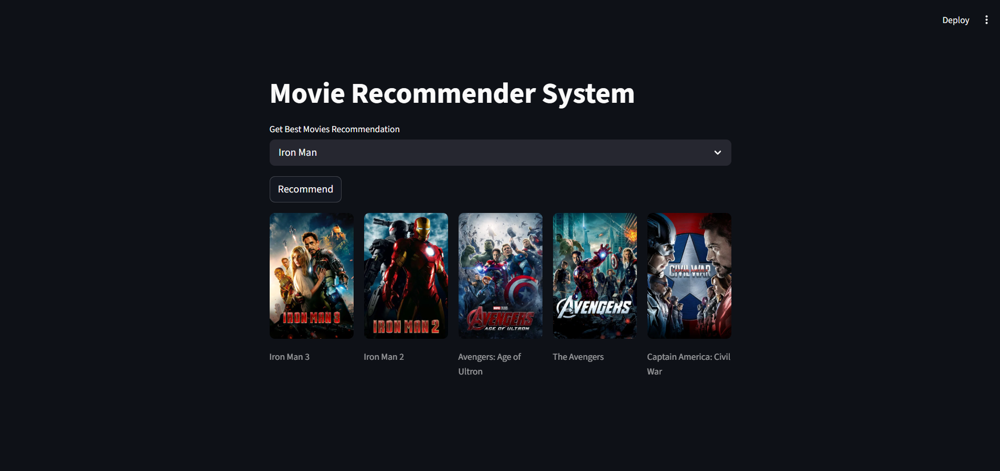

# 🎬 Movie Recommender System

A **Content-Based Movie Recommender System** built using **Python, Machine Learning, and Streamlit**.
This application recommends movies similar to the one selected by the user.

---

## 📸 Application Screenshot



---

## ⚙️ Tech Stack

* Python
* Pandas
* Scikit-learn
* Streamlit
* TMDB API

---

## 🧠 How It Works

The recommender system uses **content-based filtering**.

Steps:

1. Movie datasets are preprocessed.
2. Important features like **genres, keywords, cast, and crew** are combined.
3. Text data is converted using **CountVectorizer**.
4. **Cosine similarity** is calculated between movies.
5. The system recommends movies with the highest similarity score.

---

## 📂 Dataset

Dataset used:

* TMDB 5000 Movies Dataset

Files used:

* `tmdb_5000_movies.csv`
* `tmdb_5000_credits.csv`

---

## ▶️ Run the Project Locally

Clone the repository:

```
git clone https://github.com/yourusername/movie-recommender-system.git
```

Install dependencies:

```
pip install -r requirements.txt
```

Run the app:

```
streamlit run app.py
```

---

## ⭐ Features

* Movie recommendation based on similarity
* Movie posters fetched using TMDB API
* Interactive UI with Streamlit
* Fast recommendation system

---

## 📌 Future Improvements

* Add search suggestions
* Improve recommendation accuracy
* Add movie ratings and trailers
* Deploy the application online

---

## 👨‍💻 Author

Developed by **Kishan Kumar**

If you like the project, feel free to ⭐ the repository!
